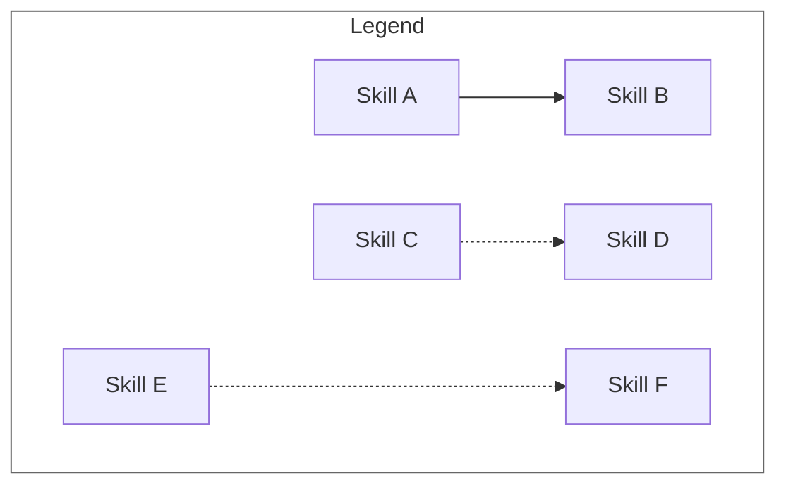

# Skill Dependency Graph

> Auto-generated by `skill-graph` on 2026-04-17. Re-run the skill to update.

Visual map of all 91+ Aeon skills grouped by category, with dependency edges showing how skills connect.

## Architecture Overview



| Edge | Meaning |
|------|---------|
| `-->` solid | `depends_on` — skill requires another to run first |
| `-.->` dashed | `consume` — chain step receives output from prior step |
| `-..->` dotted | reactive trigger or shared state dependency |

---

## Full Dependency Map

```mermaid
flowchart LR
    %% ── Research & Content ──────────────────────────────
    subgraph research ["Research & Content (17)"]
        article[article]
        channel-recap[channel-recap]
        deep-research[deep-research]
        digest[digest]
        fetch-tweets[fetch-tweets]
        hn-digest[hacker-news-digest]
        last30[last30]
        list-digest[list-digest]
        paper-digest[paper-digest]
        paper-pick[paper-pick]
        reddit-digest[reddit-digest]
        research-brief[research-brief]
        rss-digest[rss-digest]
        security-digest[security-digest]
        technical-explainer[technical-explainer]
        telegram-digest[telegram-digest]
        vibecoding-digest[vibecoding-digest]
    end

    %% ── Dev & Code ──────────────────────────────────────
    subgraph dev ["Dev & Code (28)"]
        auto-merge[auto-merge]
        auto-workflow[auto-workflow]
        autoresearch[autoresearch]
        changelog[changelog]
        code-health[code-health]
        create-skill[create-skill]
        deploy-prototype[deploy-prototype]
        external-feature[external-feature]
        fleet-control[fleet-control]
        fork-fleet[fork-fleet]
        github-issues[github-issues]
        github-monitor[github-monitor]
        github-releases[github-releases]
        github-trending[github-trending]
        issue-triage[issue-triage]
        pr-review[pr-review]
        project-lens[project-lens]
        push-recap[push-recap]
        repo-actions[repo-actions]
        repo-article[repo-article]
        repo-pulse[repo-pulse]
        repo-scanner[repo-scanner]
        search-skill[search-skill]
        skill-security-scan[skill-security-scan]
        spawn-instance[spawn-instance]
        vercel-projects[vercel-projects]
        vuln-scanner[vuln-scanner]
        workflow-security-audit[workflow-security-audit]
    end

    %% ── Crypto & Markets ────────────────────────────────
    subgraph crypto ["Crypto & Markets (16)"]
        defi-monitor[defi-monitor]
        defi-overview[defi-overview]
        distribute-tokens[distribute-tokens]
        market-context-refresh[market-context-refresh]
        monitor-kalshi[monitor-kalshi]
        monitor-polymarket[monitor-polymarket]
        monitor-runners[monitor-runners]
        narrative-tracker[narrative-tracker]
        on-chain-monitor[on-chain-monitor]
        polymarket-comments[polymarket-comments]
        token-alert[token-alert]
        token-movers[token-movers]
        token-pick[token-pick]
        token-report[token-report]
        treasury-info[treasury-info]
        unlock-monitor[unlock-monitor]
    end

    %% ── Social ──────────────────────────────────────────
    subgraph social ["Social (7)"]
        agent-buzz[agent-buzz]
        farcaster-digest[farcaster-digest]
        refresh-x[refresh-x]
        remix-tweets[remix-tweets]
        reply-maker[reply-maker]
        tweet-roundup[tweet-roundup]
        write-tweet[write-tweet]
    end

    %% ── Productivity & Meta ─────────────────────────────
    subgraph productivity ["Productivity & Meta (24)"]
        action-converter[action-converter]
        cost-report[cost-report]
        daily-routine[daily-routine]
        deal-flow[deal-flow]
        evening-recap[evening-recap]
        goal-tracker[goal-tracker]
        heartbeat[heartbeat]
        idea-capture[idea-capture]
        morning-brief[morning-brief]
        reflect[reflect]
        reg-monitor[reg-monitor]
        rss-feed[rss-feed]
        self-improve[self-improve]
        skill-evals[skill-evals]
        skill-health[skill-health]
        skill-leaderboard[skill-leaderboard]
        skill-repair[skill-repair]
        skill-update-check[skill-update-check]
        startup-idea[startup-idea]
        syndicate-article[syndicate-article]
        tool-builder[tool-builder]
        update-gallery[update-gallery]
        weekly-review[weekly-review]
        weekly-shiplog[weekly-shiplog]
    end

    %% ── Direct Dependencies (depends_on) ────────────────
    skill-repair --> skill-health
    tool-builder --> action-converter
    external-feature --> repo-scanner
    vuln-scanner --> github-trending

    %% ── Chain Relationships (consume) ───────────────────
    daily-routine -.-> token-movers
    daily-routine -.-> paper-pick
    daily-routine -.-> github-issues
    daily-routine -.-> hn-digest

    %% ── Self-Healing Loop (shared state) ────────────────
    heartbeat -..-> skill-health
    skill-health -..-> skill-evals
    skill-evals -..-> skill-repair
    skill-repair -..-> self-improve

    %% ── Shared State Dependencies ───────────────────────
    autoresearch -..-> skill-health
    market-context-refresh -..-> token-pick
    market-context-refresh -..-> narrative-tracker

    %% ── Content Pipeline ────────────────────────────────
    article -..-> syndicate-article
    article -..-> rss-feed
    article -..-> update-gallery

    %% ── Category Styles ────────────────────────────────
    style research fill:#e8f4fd,stroke:#2196F3,color:#000
    style dev fill:#e8f5e9,stroke:#4CAF50,color:#000
    style crypto fill:#fff3e0,stroke:#FF9800,color:#000
    style social fill:#fce4ec,stroke:#E91E63,color:#000
    style productivity fill:#f3e5f5,stroke:#9C27B0,color:#000
```



---

## Key Architectural Patterns

### Self-Healing Loop

The most important dependency chain in Aeon. Five skills form a closed loop that detects, diagnoses, and fixes problems without human intervention:

```
heartbeat (3x daily) → skill-health (daily) → skill-evals (weekly) → skill-repair (reactive) → self-improve (every other day)
```

Each skill reads from `memory/cron-state.json` and `memory/skill-health/` — shared state files updated after every skill run. The loop converges: heartbeat detects failures, skill-health classifies severity, skill-evals catches quality regressions, skill-repair patches broken skills, and self-improve evolves prompts and config.

### Hub Skills

Skills that aggregate output from multiple sources:

| Hub | Consumes |
|-----|----------|
| `daily-routine` | `token-movers`, `paper-pick`, `github-issues`, `hacker-news-digest` |
| `morning-brief` | Memory, logs, goals |
| `evening-recap` | Day's logs, cron-state |

### Data Providers

Skills that write shared state consumed by downstream skills:

| Provider | Writes to | Consumed by |
|----------|-----------|-------------|
| `market-context-refresh` | `memory/topics/market-context.md` | `token-pick`, `narrative-tracker` |
| All skills | `memory/cron-state.json` | `heartbeat`, `skill-health`, `skill-repair`, `self-improve`, `autoresearch` |
| Content skills | `articles/*.md` | `syndicate-article`, `rss-feed`, `update-gallery` |

### Content Pipeline

Articles flow through a distribution pipeline:

```
article / repo-article / project-lens → syndicate-article (Dev.to) → rss-feed (Atom XML) → update-gallery (GitHub Pages)
```

### Direct Dependencies

| Skill | Depends On | Why |
|-------|-----------|-----|
| `skill-repair` | `skill-health` | Needs health metrics to identify what to fix |
| `tool-builder` | `action-converter` | Builds scripts from action-converter suggestions |
| `external-feature` | `repo-scanner` | Needs repo inventory to pick enhancement targets |
| `vuln-scanner` | `github-trending` | Audits trending repos for vulnerabilities |

---

## Summary

| Metric | Count |
|--------|-------|
| Total skills | 91 |
| Categories | 5 |
| Direct dependencies (`depends_on`) | 4 |
| Chain relationships (`consume`) | 4 |
| Shared state edges | 9 |
| Reactive trigger edges | 1 |
| Independent skills (no edges) | ~73 |

The architecture is intentionally decoupled — most skills run independently on their own cron schedule. Dependencies cluster around two patterns: the **self-healing loop** (5 interconnected meta skills) and the **content pipeline** (article creation through distribution). This flat structure means any skill can fail without cascading failures across the system.
